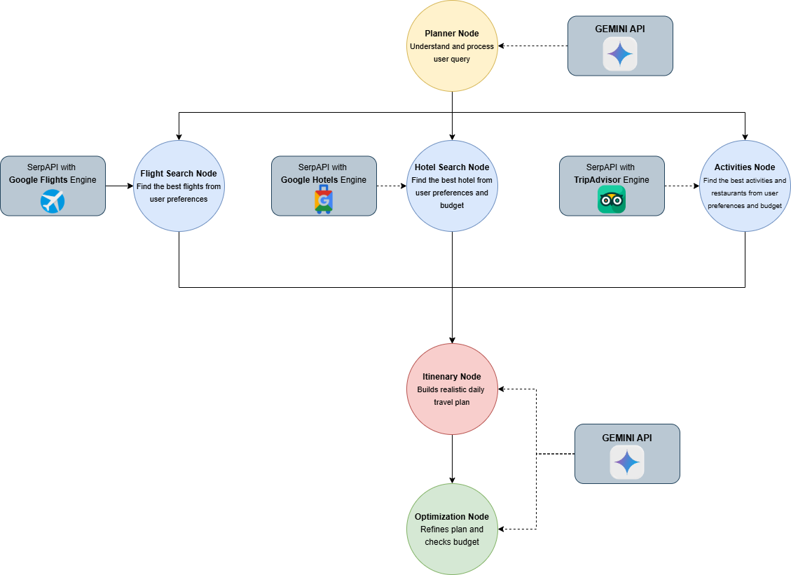

# ✈️ Agentic AI Travel Planner

An intelligent, multi-agent travel planning system powered by **LangGraph**, **Google Gemini**, and **SerpApi**. This system orchestrates a team of specialized AI agents to research, plan, and optimize your perfect trip.

---

## 🏗️ System Overview

The **Agentic AI Travel Planner** is a backend service built with **FastAPI** that leverages advanced Agentic AI patterns to automate the complex task of travel planning. It uses a stateful graph to manage the workflow, ensuring each step of the planning process is handled by a specialized agent with access to real-time data.

### 🛠️ Tech Stack

- **Language:**  3.13+
- **API Framework:** 
- **Agentic Orchestration:**  & **LangGraph**
- **LLM Engine:** 
- **Real-time Search:** **SerpApi** (Google Flights, Hotels, and Local Search)
- **Testing:** 
- **Environment:** 

---

## 🔄 Workflow



The system follows a structured, linear **Agentic Workflow** managed by a `StateGraph`:

1.  **🎯 Planner Node**: Analyzes the user's trip request, identifies destinations, and sets initial budget/preference parameters.
2.  **✈️ Flight Search Node**: Uses real-time search to find the best flight options matching the user's schedule.
3.  **🏨 Hotel Search Node**: Finds accommodation within the specified budget and location.
4.  **🎡 Activities Node**: Researches local attractions and restaurants based on user preferences.
5.  **📅 Itinerary Builder Node**: Synthesizes all gathered data into a comprehensive, day-by-day itinerary.
6.  **⚖️ Optimization Node**: Performs final budget checks and logical refinements to ensure a smooth trip.

---

## 🤖 Agentic AI Components & Characteristics

- **Stateful Orchestration:** Uses `LangGraph` to maintain a consistent `AgentState` across all nodes, preventing context loss.
- **Specialized Agents:** Each node acts as a domain-specific expert (e.g., Flight Expert, Itinerary Designer).
- **Tool Augmentation:** Agents are equipped with `SerpAPIService` to break out of the LLM's knowledge cutoff and fetch real-world data.
- **Structured Output:** Uses Gemini to transform unstructured search results into clean, actionable JSON data.
- **Autonomous Error Handling:** Logic within nodes handles missing data or search failures gracefully.

---

## 🧪 Quality Assurance & Testing

The system includes a robust test suite to ensure reliability across the agentic pipeline:

- **Unit Tests for Nodes:** Located in `test_nodes.py`, these tests use `unittest.mock` to simulate LLM and API responses, verifying that each agent processes state correctly.
- **Service Integration Tests:** `test_gemini_service.py` and `test_serpapi_service.py` validate the connection and data parsing for external providers.
- **API Endpoint Tests:** `test_api.py` ensures the FastAPI routes are responsive and handle requests correctly.

To run tests:
```bash
pytest backend/app/tests
```

---

## 🚀 Getting Started

1. **Clone the repo**
2. **Setup Environment Variables:**
   Create a `.env` file in the `backend` directory:
   ```env
   GEMINI_API_KEY=your_key_here
   SERPAPI_API_KEY=your_key_here
   ```
3. **Install Dependencies:**
   ```bash
   pip install -r backend/requirements.txt
   ```
4. **Run the Server:**
   ```bash
   python backend/main.py
   ```
   The API will be available at `http://localhost:8000`.

---
Developed with ❤️ for modern travelers.
